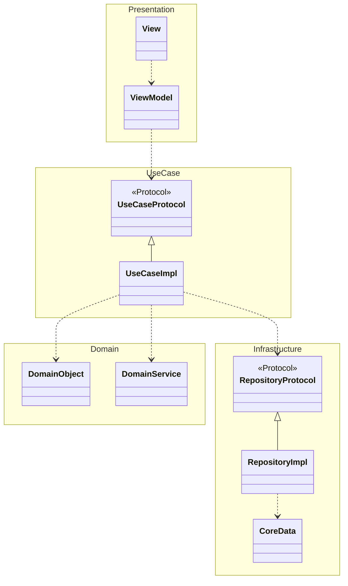
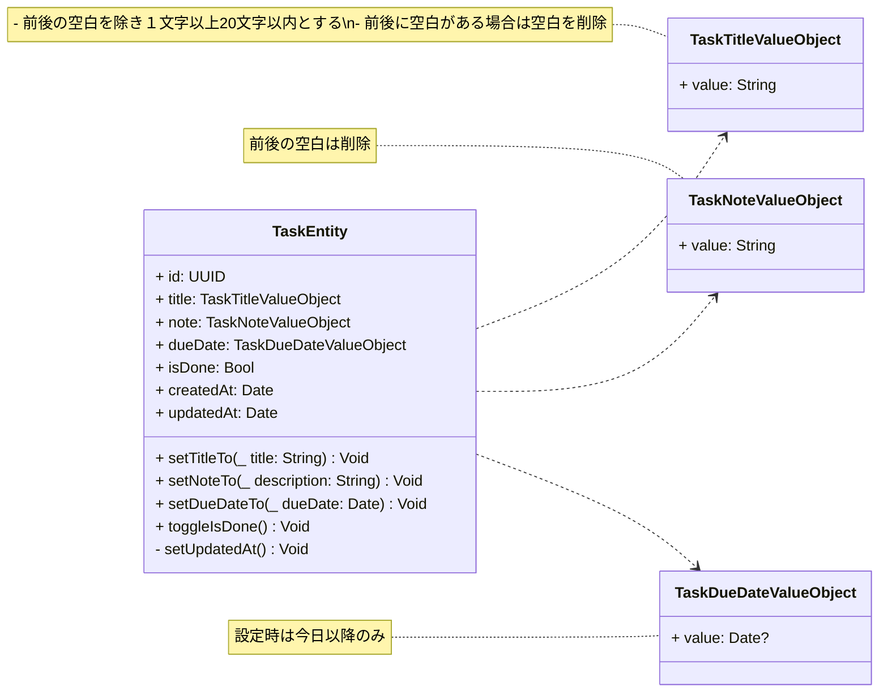

# swiftui-mvvm-clean-architecture-todo

## Architecture

Clean Architecture をベースに実装しています。  
Presentation 層は MVVM で実装しています。

```mermaid
classDiagram
namespace Presentation {
  class View
  class ViewModel
}
namespace UseCase {
  class UseCaseProtocol
  class UseCaseImpl
}
namespace Domain {
  class DomainObject
  class DomainService
}
namespace Infrastructure {
  class RepositoryProtocol
  class RepositoryImpl
  class CoreData
}

direction TB
View ..> ViewModel
ViewModel ..> UseCaseProtocol
UseCaseProtocol <|-- UseCaseImpl
UseCaseImpl ..> DomainObject
UseCaseImpl ..> DomainService
UseCaseImpl ..> RepositoryProtocol
RepositoryProtocol <|-- RepositoryImpl
RepositoryImpl ..> CoreData

<<Protocol>> UseCaseProtocol
<<Protocol>> RepositoryProtocol

```

## ドメインモデル図

```mermaid
classDiagram
direction LR
class TaskEntity {
  + id: UUID
  + title: TaskTitleValueObject
  + note: TaskNoteValueObject
  + dueDate: TaskDueDateValueObject
  + isDone: Bool
  + createdAt: Date
  + updatedAt: Date
  + setTitleTo(_ title: String) Void
  + setNoteTo(_ description: String) Void
  + setDueDateTo(_ dueDate: Date) Void
  + toggleIsDone() Void
  - setUpdatedAt() Void
}
class TaskTitleValueObject {
  + value: String
}
class TaskNoteValueObject {
  + value: String
}
class TaskDueDateValueObject {
  + value: Date?
}

TaskEntity ..> TaskTitleValueObject
TaskEntity ..> TaskNoteValueObject
TaskEntity ..> TaskDueDateValueObject

note for TaskTitleValueObject "- 前後の空白を除き１文字以上20文字以内とする\n- 前後に空白がある場合は空白を削除"
note for TaskNoteValueObject "前後の空白は削除"
note for TaskDueDateValueObject "設定時は今日以降のみ"
```
