# swiftui-mvvm-clean-architecture-todo

Clean Architecture をベースに実装しています。  
Presentation 層は MVVM を採用しています。

https://github.com/user-attachments/assets/9479f6f3-3c54-46d8-8ca1-db5e022d50bd

## アーキテクチャ

## ドメインモデル図

```mermaid
classDiagram
direction LR
class TaskEntity {
  + id: UUID
  + title: TaskTitleValueObject
  + note: TaskNoteValueObject
  + dueDate: TaskDueDateValueObject
  + isDone: Bool
  + createdAt: Date
  + updatedAt: Date
  + setTitleTo(_ title: String) Void
  + setNoteTo(_ description: String) Void
  + setDueDateTo(_ dueDate: Date) Void
  + toggleIsDone() Void
  - setUpdatedAt() Void
}
class TaskTitleValueObject {
  + value: String
}
class TaskNoteValueObject {
  + value: String
}
class TaskDueDateValueObject {
  + value: Date?
}

TaskEntity *-- TaskTitleValueObject: title
TaskEntity *-- TaskNoteValueObject: note
TaskEntity *-- TaskDueDateValueObject: dueDate

note for TaskTitleValueObject "- 前後の空白を除き１文字以上20文字以内とする\n- 前後に空白がある場合は空白を削除"
note for TaskNoteValueObject "前後の空白は削除"
note for TaskDueDateValueObject "設定時は今日以降のみ"
```

